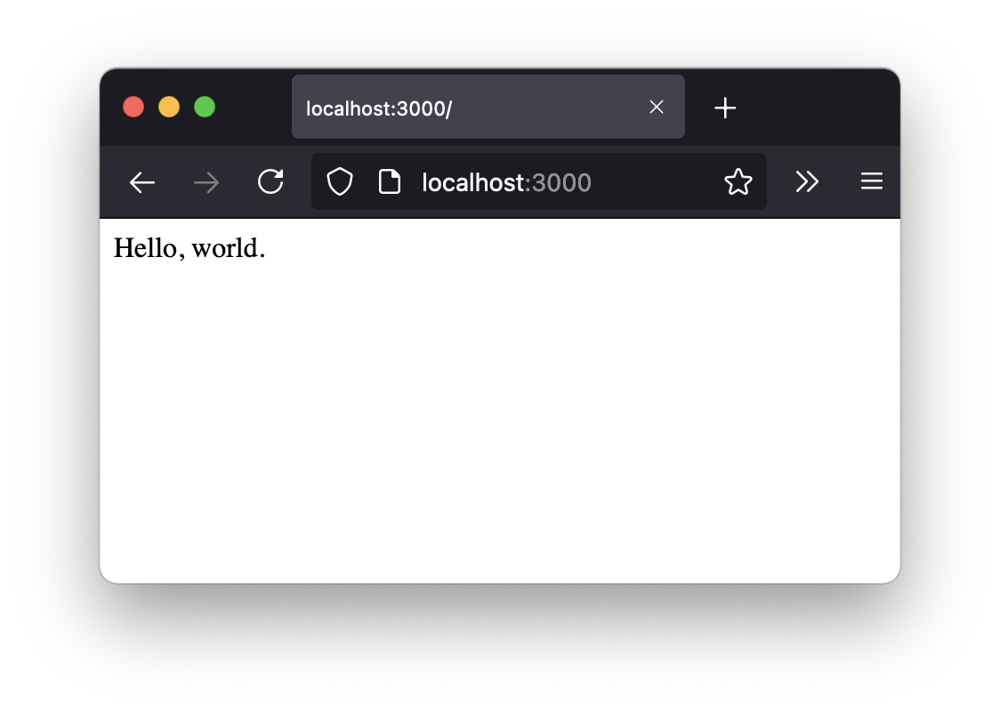
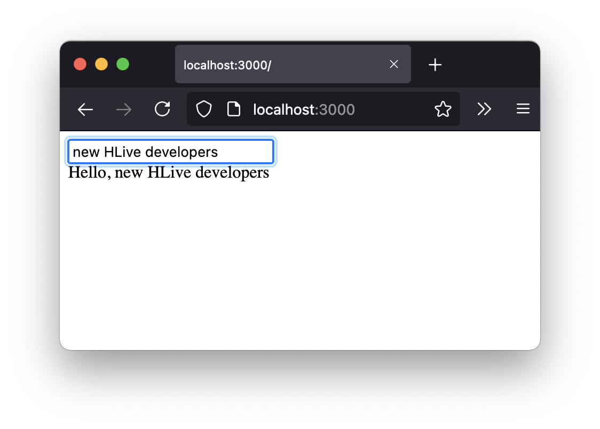

# HLive
HLive is a server-side WebSocket based dynamic template-less view layer for Go.

HLive is a fantastic tool for creating complex and dynamic browser-based user interfaces for developers who want to keep all the logic in Go. It's a great use case for admin interfaces and internal company tools.


## Quick Start Tutorial

### Step 1: Static Page

Import HLive using the optional alias `l`:

```go
package main

import l "github.com/SamHennessy/hlive"
```

Let's create our first page:

```go

func home() *l.Page {
	page := l.NewPage()
	page.Body.Add("Hello, world.")

	return page
}
```

Next we use a `PageServer` to add it to an HTTP router:

```go
func main() {
	http.Handle("/", l.NewPageServer(home))

	log.Println("Listing on :3000")

	if err := http.ListenAndServe(":3000", nil); err != nil {
		log.Println("Error: http listen and serve:", err)
	}
}
```

Your editor should add the extra imports `http` and `log` for you.

You can now run it, for example:
```shell
go run ./tutorial/helloworld/helloworld.go
```

In a browser go to http://localhost:3000 you should see this:



### Step 2: Interactive Page
HLive is all about interactive content. We're going to add a text input field to let us type our own hello message.

We need to replace our existing `home` function. We need a string to hold our message:

```go
func home() *l.Page {
	var message string
```

Now we're going to create a `Component`. `Component`'s are HTML tags that can react to browser events. We are going to base our `Component` on the `input` HTML tag.

```go
	input := l.C("input")
```

We want to set the input to a text type. We do this adding a`Attrs` map to our `Component`.

```go
	input.Add(l.Attrs{"type": "text"})
```

Here we add an `EventBinding`. This binding will trigger on key up in the browser. When the event's triggered, the handler function will be called. Our handler will update `message`. It does this by using what was passed from the `Event`.

```go
	input.On(l.OnKeyUp(func(ctx context.Context, e l.Event) {
		message = e.Value
	}))
```

We create a new `Page` like before:

```go
	page := l.NewPage()
```

Here we add our `input` to the body but first we wrap it in a `div` tag.

```go
	page.Body.Add(l.T("div", input))
```

Next, we will display our message. Notice that we're passing `message` by reference. That's key for making this work.

```go
	page.Body.Add("Hello, ", &message)
```

Finally, we return the `Page` we created.
```go
	return page
}
```

Let's see that all together, but this time I'm going to use some shortcuts. Can you spot the differences?

```go
func home() *l.Page {
	var message string

	input := l.C("input",
		l.Attrs{"type": "text"},
		l.OnKeyUp(func(ctx context.Context, e l.Event) {
			message = e.Value
		}),
	)

	page := l.NewPage()
	page.Body.Add(
		l.T("div", input),
		"Hello, ", &message,
	)

	return page
}
```

Run it and type something into the input. The page should update to display what you typed.



## Concepts

### Tag

A static HTML tag. A Tag has a name (e.g., an `<p></p>`'s name is `hr`). A Tag can have zero or more Attributes. A Tag can have child Tags nested inside it. A Tag may be Void, which means it doesn't have a closing tag (e.g., `<hr>`). Void tags can't have child Tags.

### Attribute

An Attribute has a name and an optional value.  (e.g., `href="https://example.com"` or `disabled`).

#### CSS Classes

The HLive implementation of Tag has an optional special way to work with the `class` attribute.

HLive's `CSS` is a `map[string]bool` type. The key is a CSS class, and the value enables the class for rending if true. This allows you to turn a class on and off.

The order of the class names in a single `CSS` is NOT respected. If the order of class names is significant, you can add them as separate `CSS` elements, and the order will be respected.

You can add new `CSS` elements with the same class name, and the original `CSS` element will be updated. Using this type allows you to turn classes on and off (e.g., show and hide) without growing the Tag's data.

#### Style Attribute

The HLive implementation of Tag has an optional special way to work with the `style` attribute.

HLive's `Style` is a `map[string]interface{}` type. The key is the CSS rule, and the value is the value of the rule. The value can be a `string` or `nil`. If `nil`, the style rule gets removed.

The order of the style rules in a single `Style` is NOT respected. If the order of rules is significant, you can add them as separate `Style` elements, and the order will be respected.

### Tag Children

`Tag` has `func GetNodes() []interface{}`. This will return can children a `Tag` has.

This function may be called many times and not always when it's time to render. Calls to `GetNodes` must
be [deterministic](https://en.wikipedia.org/wiki/Deterministic_algorithm). If you've not made a change to the `Tag`
the output is expected to be the same.

This function must never get or change data. No calls to a remote API or database.

### Components

A `Compnent` wraps a `Tag`. It adds the ability to bind events that primarily happens in the browser to itself.

#### EventBinding

An `EventBinding` is a combination of an `EventType` (e.g., click, focus, mouseenter), with a `Component` and an `EventHandler`.

#### EventHandler

The `EventHandler` is a `func(ctx context.Context, e Event)` type.

These handlers are where you can fetch data from remote APIs or databases.

Depending on the `EventType` you'll have data in the `Event` parameter.

### Node

A Node is something that can be rendered into an HTML tag. For example, `Tag`, `Component`, or `RenderFunc`. An
`Attribute` is not a Node as it can't be rendered to a complete HTML tag.

### Element

An Element is anything associated with a `Tag` or `Component`. This means that in addition to nodes, `Attribute` and `EventBinding` are also Elements.

### Page

A `Page` is the root element in HLive. There will be a single page instance for a single connected user.

`Page` has HTML5 boilerplate pre-defined. This boilerplate also includes HLive's JavaScript.

#### HTML vs WebSocket

When a user requests a page, there are two requests. First is the initial request that generates the pages HTML. Then the second request is to establish a WebSocket connection.

HLive considers the initial HTML generation a throwaway process. We make no assumptions that there will be a WebSocket connection for that exact HTML page.

When an HLive HTML page is loaded in a browser, the HLive JavaScript library will kick into action.

The first thing the JavaScript will do is establish a WebSocket connection to the server. This connection is made using the same URL with `?ws=1` added to the URL. Due to typical load balancing strategies, the server that HLive establishes a Websocket connection to may not be the one that generated the initial HTML.

### PageSession

When the JavaScript establishes the WebSocket connection, the backend will create a new session and send down the session id to the browser.

A `PageSession` represents a single instance of a `Page`. There will be a single WebSocket connection to a `PageSession`.

### PageServer

The `PageServer` is what handles incoming HTTP requests. It's an `http.Handler`, so it can be using in your router of choice. When `PageServer` receives a request, if the request has the `ws=1` query parameter, it will start the WebSocket flow. It will create a new instance of your `Page`. It will then make a new `PageSession`. Finally, it will pass the request to `Page` `ServerWS` function.


If not, then it will create a new `Page`, generate a complete HTML page render and return that and discard that `Page`.

### Middleware

It's possible to wrap `PageServer` in middleware. You can add data to the context like normal. The context will be passed to your `Component`'s `Mount` function if it has one.

### PageSessionStore

To manage your all the `PageSession`s `PageServer` uses a `PageSessionStore`. By default, each page gets its own `PageSessionStore`, but it's recommended that you have a single `PageSessionStore` that's shared by all your `Page`s.

`PageSessionStore` can control the number of active `PageSession`s you have at one time. This control can prevent your servers from becoming overloaded. Once the `PageSession` limit is reached, `PageSessionStore` will make incoming WebSocket requests wait for an existing connection to disconnect.


### HTTP vs WebSocket Render

`Mount` is not called on HTTP requests but is called on WebSocket requests.

### Tree and Tree Copy

Tree describes a Node and all it's child Nodes.

Tree copy is a critical process that takes your `Page`'s Tree and makes a simplified clone of it. Once done, the only elements in the cloned Tree are `Tag`s and `Attribute`s.

### WebSocket Render and Tree Diffing

When it's time to do a WebSocket render, no HTML is rendered *(1)*. What happens is a new Tree Copy is created from the `Page`. This Tree is compared to the Tree that's in that should be in the browser. The differences are calculated, and instructions are sent to the browser on updating its DOM with our new Tree.


*(1) except Attributes, but that's just convenient data format.*

### First WebSocket Render

When a WebSocket connection is successfully established, we need to do 2 `Page` renders. The first is to duplicate what should be in the browser. This render will be creating a Tree Copy as if it were going to be rendered to HTML. This Tree is then set as the "current" Tree. Then a WebSocket Tree Copy is made. This copy will contain several attributes not present in the HTML Tree. Also, each `Component` in the Tree that implements `Mounter` will be called with the context, meaning the Tree may also have more detail based on any data fetched. This render will then be diffed against the "current" Tree and the diff instructions sent to the browser like normal.

For an initial, successful `Page` load there will be 3 renders, 2 HTML renders and a WebSocket render.

### AutoRender and Manuel Render

By default, HLive's `Component` will trigger a WebSocket render every time an `EventBinding` is triggered.

This behaviour can be turned off on `Component` by setting `AutoRender` to `false`.

If you set `AutoRender` to `false` you can manually trigger a WebSocket render by calling `hlive.RenderWS(ctx context.Context)` with the context passed to your handler.

### Local Render

If you want only to render a single `Component` and not the whole page, you can call `hlive.RenderComponentWS(ctx context.Context, comp Componenter)` you will also want to set any relevant `Component`s to `AutoRender` `false`.

### HTML Type

HLive's `HTML` type is a special `string` type that will render what you've set. One rule is that the HTML in `HTML` have a single root node.

### JavaScript

The goal of HLive is not to require the developer to need to write any JavaScript. As such, we have unique solutions for things like giving fields focus.

Nothing is preventing the developer from adding their JavaScript. If JavaScript changes the DOM in the browser, you could cause HLive's diffing to stop working.

### Virtual DOM, Browser DOM

HLive is blind to what the actual state of the browser's DOM is. It assumes that it what it has set it to.

### Lifecycle

TODO

## Inspiration

### Phoenix LiveView

For the concept of server-side rendering for dynamic applications.

https://hexdocs.pm/phoenix_live_view/Phoenix.LiveView.html

### gomponents

For it's HTML API.

https://github.com/maragudk/gomponents

### ReactJS and JSX

For its component approach and template system.

https://reactjs.org/

## TODO:

- Store to database demo
- add WS ping-pong
- CSS animation chain, classes that will be in order, after the previous link triggers onanimationend
    - this is find of like giving focus but with focue you can turn it off using the onfocue event
    - On last step of the chain we can trigger a custom event
    - OnChainComplete, then use can remove the attribute
- Batch message sends and receives in the javascript (https://developer.mozilla.org/en-US/docs/Web/API/HTML_DOM_API/Microtask_guide)
- Add a queue for incoming messages on a page session
    - Maybe multiple concurrent requets is okay, maybe we just batch renders,
- Have non-Live pages, only using the templating for static pages
- What to do about when a page is reloaded, and the forms are prefilled with data?
- Add JavaScript test for multi child delete
    - E.g.:
    - d|d|doc|1>1>0>0>1>2||
    - d|d|doc|1>1>0>0>1>3||
- Page level events, e.g., page history.
- Remove isWebSocket from context
- Emoji's not working on input
- WS reconnect or reload on fail
    - Allow multiple reconnect tries to try to find the correct server
    - New session on fail
- If we remove reconnect we can simplify session store
- Do we make it a hard rule, one page one user?
- If multiple sockets are connected to the same page will the inital load of later pages work?
    - That that works, do we need to broadcast to the other connection that the page has changed?
